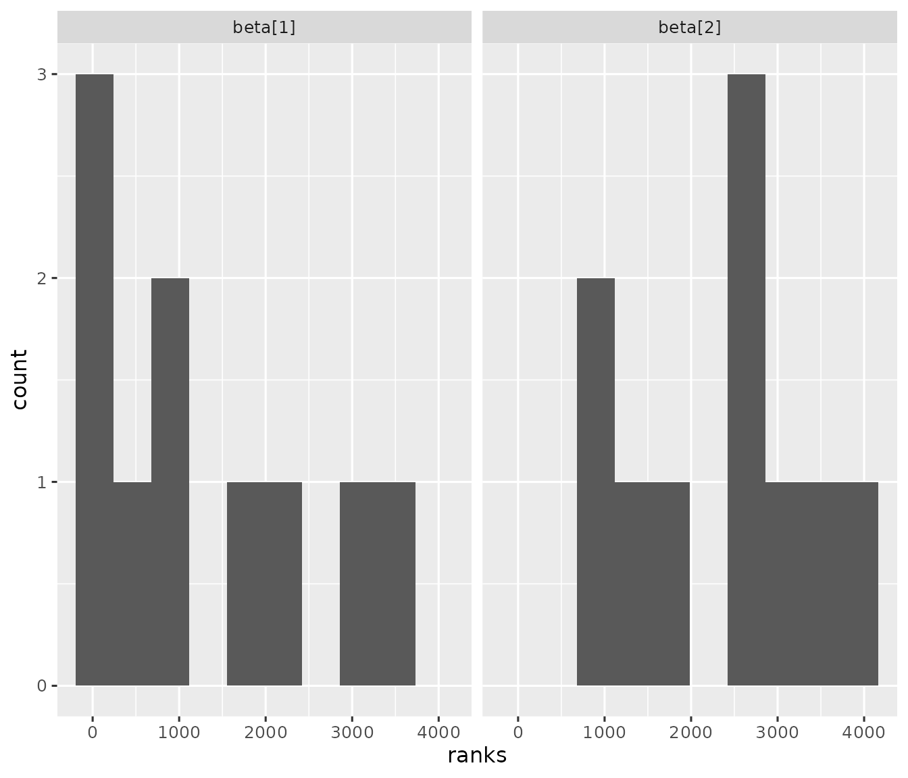

# Bayesian simulation pipelines with stantargets

## Background

The [introductory
vignette](https://docs.ropensci.org/stantargets/articles/introduction.html)
vignette caters to Bayesian data analysis workflows with few datasets to
analyze. However, it is sometimes desirable to run one or more Bayesian
models repeatedly across multiple simulated datasets. Examples:

1.  Validate the implementation of a Bayesian model using simulation.
2.  Simulate a randomized controlled experiment to explore frequentist
    properties such as power and Type I error.

This vignette focuses on (1).

## Example project

Visit <https://github.com/wlandau/stantargets-example-validation> for an
example project based on this vignette. The example has an [RStudio
Cloud workspace](https://rstudio.cloud/project/2466069) which allows you
to run the project in a web browser.

## Interval-based model validation pipeline

This particular example uses the concept of calibration that Bob
Carpenter [explains
here](https://statmodeling.stat.columbia.edu/2017/04/12/bayesian-posteriors-calibrated/)
(Carpenter 2017). The goal is to simulate multiple datasets from the
model below, analyze each dataset, and assess how often the estimated
posterior intervals cover the true parameters from the prior predictive
simulations. If coverage is no systematically different from nominal,
this is evidence that the model was implemented correctly. The quantile
method by Cook et al. (2006) generalizes this concept, and
simulation-based calibration (Talts et al. 2020) generalizes further.
The interval-based technique featured in this vignette is not as robust
as SBC, but it may be more expedient for large models because it does
not require visual inspection of multiple histograms. See a later
section in this vignette for an example of simulation-based calibration
on this same model.

``` r

lines <- "data {
  int <lower = 1> n;
  vector[n] x;
  vector[n] y;
}
parameters {
  vector[2] beta;
}
model {
  y ~ normal(beta[1] + x * beta[2], 1);
  beta ~ normal(0, 1);
}"
writeLines(lines, "model.stan")
```

Next, we define a pipeline to simulate multiple datasets and fit each
dataset with the model. In our data-generating function, we put the true
parameter values of each simulation in a special `.join_data` list.
`stantargets` will automatically join the elements of `.join_data` to
the correspondingly named variables in the summary output. This will
make it super easy to check how often our posterior intervals capture
the truth. As for scale, generate 10 datasets (5 batches with 2
replications each) and run the model on each of the 10 datasets.[^1] By
default, each of the 10 model runs computes 4 MCMC chains with 2000 MCMC
iterations each (including burn-in) and you can adjust with the
`chains`, `iter_sampling`, and `iter_warmup` arguments of
[`tar_stan_mcmc_rep_summary()`](https://docs.ropensci.org/stantargets/reference/tar_stan_mcmc_rep_summary.md).

``` r

# _targets.R
library(targets)
library(stantargets)
options(crayon.enabled = FALSE)
# Use computer memory more sparingly:
tar_option_set(memory = "transient", garbage_collection = TRUE)

simulate_data <- function(n = 10L) {
  beta <- rnorm(n = 2, mean = 0, sd = 1)
  x <- seq(from = -1, to = 1, length.out = n)
  y <- rnorm(n, beta[1] + x * beta[2], 1)
  list(
    n = n,
    x = x,
    y = y,
    .join_data = list(beta = beta)
  )
}

list(
  tar_stan_mcmc_rep_summary(
    model,
    "model.stan",
    simulate_data(), # Runs once per rep.
    batches = 5, # Number of branch targets.
    reps = 2, # Number of model reps per branch target.
    variables = "beta",
    summaries = list(
      ~posterior::quantile2(.x, probs = c(0.025, 0.975))
    ),
    stdout = R.utils::nullfile(),
    stderr = R.utils::nullfile()
  )
)
```

We now have a pipeline that runs the model 10 times: 5 batches (branch
targets) with 2 replications per batch.

``` r

tar_visnetwork()
#> Warning message:
#> package ‘targets’ was built under R version 4.6.1
```

Run the computation with
[`tar_make()`](https://docs.ropensci.org/targets/reference/tar_make.html)

``` r

tar_make()
#> + model_batch dispatched
#> ✔ model_batch completed [0ms, 98 B]
#> + model_file_model dispatched
#> ✔ model_file_model completed [4.7s, 2.67 MB]
#> + model_data declared [5 branches]
#> ✔ model_data completed [5ms, 2.54 kB]
#> + model_model declared [5 branches]
#> ✔ model_model completed [5.8s, 6.34 kB]
#> + model dispatched
#> ✔ model completed [0ms, 2.90 kB]
#> ✔ ended pipeline [11.8s, 13 completed, 0 skipped]
#> Warning message:
#> package ‘targets’ was built under R version 4.6.1
```

The result is an aggregated data frame of summary statistics, where the
`.rep` column distinguishes among individual replicates. We have the
posterior intervals for `beta` in columns `q2.5` and `q97.5`. And thanks
to `.join_data` in `simulate_data()`, there is a special `.join_data`
column in the output to indicate the true value of each parameter from
the simulation.

``` r

tar_load(model)
model
#> # A tibble: 20 × 9
#>    variable      q2.5   q97.5 .join_data .rep     .dataset_id  .seed .file .name
#>    <chr>        <dbl>   <dbl>      <dbl> <chr>    <chr>        <int> <chr> <chr>
#>  1 beta[1]   0.359     1.55       0.449  be2f145… model_data… 5.71e8 mode… model
#>  2 beta[2]  -1.74      0.0464    -0.712  be2f145… model_data… 5.71e8 mode… model
#>  3 beta[1]   1.51      2.69       2.18   ef03cb8… model_data… 1.03e9 mode… model
#>  4 beta[2]  -0.806     0.873      0.315  ef03cb8… model_data… 1.03e9 mode… model
#>  5 beta[1]   0.544     1.71       0.892  1a5d27a… model_data… 1.92e9 mode… model
#>  6 beta[2]   1.40      3.21       1.98   1a5d27a… model_data… 1.92e9 mode… model
#>  7 beta[1]   1.35      2.54       1.33   aec745e… model_data… 1.95e9 mode… model
#>  8 beta[2]  -0.926     0.810     -0.454  aec745e… model_data… 1.95e9 mode… model
#>  9 beta[1]  -0.0663    1.12       0.0642 5972613… model_data… 7.78e8 mode… model
#> 10 beta[2]   0.000651  1.79       1.12   5972613… model_data… 7.78e8 mode… model
#> 11 beta[1]  -0.130     1.04       0.403  9274f1b… model_data… 1.90e9 mode… model
#> 12 beta[2]  -0.992     0.732      0.868  9274f1b… model_data… 1.90e9 mode… model
#> 13 beta[1]  -1.09      0.143     -0.262  2624ff1… model_data… 3.01e8 mode… model
#> 14 beta[2]   0.836     2.56       1.66   2624ff1… model_data… 3.01e8 mode… model
#> 15 beta[1]  -0.406     0.809     -0.548  94540fa… model_data… 5.21e8 mode… model
#> 16 beta[2]   0.680     2.43       1.39   94540fa… model_data… 5.21e8 mode… model
#> 17 beta[1]  -0.998     0.152     -0.120  fd6c8fc… model_data… 1.10e9 mode… model
#> 18 beta[2]  -0.117     1.66       0.931  fd6c8fc… model_data… 1.10e9 mode… model
#> 19 beta[1]  -2.06     -0.880     -1.75   562b227… model_data… 1.34e9 mode… model
#> 20 beta[2]  -1.93     -0.179     -0.474  562b227… model_data… 1.34e9 mode… model
```

Now, let’s assess how often the estimated 95% posterior intervals
capture the true values of `beta`. If the model is implemented
correctly, the coverage value below should be close to 95%. (Ordinarily,
we would [increase the number of batches and reps per
batch](https://books.ropensci.org/targets/dynamic.html#batching) and
[run batches in parallel
computing](https://books.ropensci.org/targets/hpc.html).)

``` r

library(dplyr)
model %>%
  group_by(variable) %>%
  summarize(coverage = mean(q2.5 < .join_data & .join_data < q97.5))
#> # A tibble: 2 × 2
#>   variable coverage
#>   <chr>       <dbl>
#> 1 beta[1]       0.8
#> 2 beta[2]       0.9
```

For maximum reproducibility, we should express the coverage assessment
as a custom function and a target in the pipeline.

``` r

# _targets.R
library(targets)
library(stantargets)

simulate_data <- function(n = 10L) {
  beta <- rnorm(n = 2, mean = 0, sd = 1)
  x <- seq(from = -1, to = 1, length.out = n)
  y <- rnorm(n, beta[1] + x * beta[2], 1)
  list(
    n = n,
    x = x,
    y = y,
    .join_data = list(beta = beta)
  )
}

list(
  tar_stan_mcmc_rep_summary(
    model,
    "model.stan",
    simulate_data(),
    batches = 5, # Number of branch targets.
    reps = 2, # Number of model reps per branch target.
    variables = "beta",
    summaries = list(
      ~posterior::quantile2(.x, probs = c(0.025, 0.975))
    ),
    stdout = R.utils::nullfile(),
    stderr = R.utils::nullfile()
  ),
  tar_target(
    coverage,
    model %>%
      group_by(variable) %>%
      summarize(coverage = mean(q2.5 < .join_data & .join_data < q97.5))
  )
)
```

The new `coverage` target should the only outdated target, and it should
be connected to the upstream `model` target.

``` r

tar_visnetwork()
#> + model_data declared [5 branches]
#> + model_model declared [5 branches]
#> Warning message:
#> package ‘targets’ was built under R version 4.6.1
```

When we run the pipeline, only the coverage assessment should run. That
way, we skip all the expensive computation of simulating datasets and
running MCMC multiple times.

``` r

tar_make()
#> + model_data declared [5 branches]
#> + model_model declared [5 branches]
#> + coverage dispatched
#> ✔ coverage completed [7ms, 175 B]
#> ✔ ended pipeline [178ms, 1 completed, 13 skipped]
#> Warning message:
#> package ‘targets’ was built under R version 4.6.1
```

``` r

tar_read(coverage)
#> # A tibble: 2 × 2
#>   variable coverage
#>   <chr>       <dbl>
#> 1 beta[1]       0.8
#> 2 beta[2]       0.9
```

## Multiple models

`tar_stan_rep_mcmc_summary()` and similar functions allow you to supply
multiple Stan models. If you do, each model will share the the same
collection of datasets, and the `.dataset_id` column of the model target
output allows for custom analyses that compare different models against
each other. Suppose we have a new model, `model2.stan`.

``` r

lines <- "data {
  int <lower = 1> n;
  vector[n] x;
  vector[n] y;
}
parameters {
  vector[2] beta;
}
model {
  y ~ normal(beta[1] + x * x * beta[2], 1); // Regress on x^2 instead of x.
  beta ~ normal(0, 1);
}"
writeLines(lines, "model2.stan")
```

To set up the simulation workflow to run on both models, we add
`model2.stan` to the `stan_files` argument of
`tar_stan_rep_mcmc_summary()`. And in the coverage summary below, we
group by `.name` to compute a coverage statistic for each model.

``` r

# _targets.R
library(targets)
library(stantargets)

simulate_data <- function(n = 10L) {
  beta <- rnorm(n = 2, mean = 0, sd = 1)
  x <- seq(from = -1, to = 1, length.out = n)
  y <- rnorm(n, beta[1] + x * beta[2], 1)
  list(
    n = n,
    x = x,
    y = y,
    .join_data = list(beta = beta)
  )
}

list(
  tar_stan_mcmc_rep_summary(
    model,
    c("model.stan", "model2.stan"), # another model
    simulate_data(),
    batches = 5,
    reps = 2,
    variables = "beta",
    summaries = list(
      ~posterior::quantile2(.x, probs = c(0.025, 0.975))
    ),
    stdout = R.utils::nullfile(),
    stderr = R.utils::nullfile()
  ),
  tar_target(
    coverage,
    model %>%
      group_by(.name, variable) %>%
      summarize(coverage = mean(q2.5 < .join_data & .join_data < q97.5))
  )
)
```

In the graph below, notice how targets `model_model` and `model_model2`
are both connected to `model_data` upstream. Downstream, `model` is
equivalent to `dplyr::bind_rows(model_model, model_model2)`, and it will
have special columns `.name` and `.file` to distinguish among all the
models.

``` r

tar_visnetwork()
#> + model_data declared [5 branches]
#> + model_model2 declared [5 branches]
#> + model_model declared [5 branches]
#> Warning message:
#> package ‘targets’ was built under R version 4.6.1
```

## Simulation-based calibration

This section explores a more rigorous validation study which adopts the
proper simulation-based calibration (SBC) method from (Talts et al.
2020). To use this method, we need a function that generates rank
statistics from a simulated dataset and a data frame of posterior draws.
If the model is implemented correctly, these rank statistics will be
uniformly distributed for each model parameter. Our function will use
the
[`calculate_ranks_draws_matrix()`](https://hyunjimoon.github.io/SBC/reference/calculate_ranks_draws_matrix.html)
function from the [`SBC`](https://hyunjimoon.github.io/SBC/) R package
(Kim et al. 2022).

``` r

get_ranks <- function(data, draws) {
  draws <- select(draws, starts_with(names(data$.join_data)))
  truth <- map_dbl(
    names(draws),
    ~eval(parse(text = .x), envir = data$.join_data)
  )
  out <- SBC::calculate_ranks_draws_matrix(truth, as_draws_matrix(draws))
  as_tibble(as.list(out))
}
```

To demonstrate this function, we simulate a dataset,

``` r

simulate_data <- function(n = 10L) {
  beta <- rnorm(n = 2, mean = 0, sd = 1)
  x <- seq(from = -1, to = 1, length.out = n)
  y <- rnorm(n, beta[1] + x * beta[2], 1)
  list(
    n = n,
    x = x,
    y = y,
    .join_data = list(beta = beta)
  )
}

data <- simulate_data()

str(data)
#> List of 4
#>  $ n         : int 10
#>  $ x         : num [1:10] -1 -0.778 -0.556 -0.333 -0.111 ...
#>  $ y         : num [1:10] -4.093 -1.604 -0.92 -0.337 -3.25 ...
#>  $ .join_data:List of 1
#>   ..$ beta: num [1:2] -1.4 0.255
```

we make up a hypothetical set of posterior draws,

``` r

draws <- tibble(`beta[1]` = rnorm(100), `beta[2]` = rnorm(100))

draws
#> # A tibble: 100 × 2
#>    `beta[1]` `beta[2]`
#>        <dbl>     <dbl>
#>  1    2.07       0.259
#>  2   -1.63      -0.442
#>  3    0.512      0.569
#>  4   -1.86       2.13 
#>  5   -0.522      0.425
#>  6   -0.0526    -1.68 
#>  7    0.543      0.249
#>  8   -0.914      1.07 
#>  9    0.468      2.04 
#> 10    0.363      0.449
#> # ℹ 90 more rows
```

and we call `get_ranks()` to get the SBC rank statistics for each model
parameter.

``` r

library(dplyr)
library(posterior)
library(purrr)
get_ranks(data = data, draws = draws)
#> # A tibble: 1 × 2
#>   `beta[1]` `beta[2]`
#>       <dbl>     <dbl>
#> 1        10        53
```

To put this into practice in a pipeline, we supply the symbol
`get_ranks` to the `transform` argument of
[`tar_stan_mcmc_rep_draws()`](https://docs.ropensci.org/stantargets/reference/tar_stan_mcmc_rep_draws.md).
That way, instead of a full set of draws, each replication will return
only the output of `get_ranks()` on those draws (plus a few helper
columns). If supplied, the `transform` argument of
[`tar_stan_mcmc_rep_draws()`](https://docs.ropensci.org/stantargets/reference/tar_stan_mcmc_rep_draws.md)
must be the name of a function in the pipeline. This function must
accept arguments `data` and `draws`, and it must return a data frame.

``` r

# _targets.R
library(targets)
library(stantargets)

tar_option_set(packages = c("dplyr", "posterior", "purrr", "tibble"))

simulate_data <- function(n = 10L) {
  beta <- rnorm(n = 2, mean = 0, sd = 1)
  x <- seq(from = -1, to = 1, length.out = n)
  y <- rnorm(n, beta[1] + x * beta[2], 1)
  list(
    n = n,
    x = x,
    y = y,
    .join_data = list(beta = beta)
  )
}

get_ranks <- function(data, draws) {
  draws <- select(draws, starts_with(names(data$.join_data)))
  truth <- map_dbl(
    names(draws),
    ~eval(parse(text = .x), envir = data$.join_data)
  )
  out <- SBC::calculate_ranks_draws_matrix(truth, as_draws_matrix(draws))
  as_tibble(as.list(out))
}

list(
  tar_stan_mcmc_rep_draws(
    model,
    c("model.stan"),
    simulate_data(),
    batches = 5,
    reps = 2,
    variables = "beta",
    stdout = R.utils::nullfile(),
    stderr = R.utils::nullfile(),
    transform = get_ranks # Supply the transform to get SBC ranks.
  )
)
```

Our new function `get_ranks()` is a dependency of one of our downstream
targets, so any changes to `get_ranks()` will force the results to
refresh in the next run of the pipeline.

``` r

tar_visnetwork()
#> + model_data declared [5 branches]
#> + model_model declared [5 branches]
#> Warning message:
#> package ‘targets’ was built under R version 4.6.1
```

Let’s run the pipeline to compute a set of rank statistics for each
simulated dataset.

``` r

tar_make()
#> + model_data declared [5 branches]
#> + model_model declared [5 branches]
#> ✔ model_model completed [6.1s, 4.38 kB]
#> ✔ ended pipeline [6.8s, 5 completed, 7 skipped]
#> Warning message:
#> package ‘targets’ was built under R version 4.6.1
```

We have a data frame of rank statistics with one row per simulation rep
and one column per model parameter.

``` r

tar_load(model_model)

model_model
#> # A tibble: 10 × 7
#>    `beta[1]` `beta[2]` .rep             .dataset_id            .seed .file .name
#>        <dbl>     <dbl> <chr>            <chr>                  <int> <chr> <chr>
#>  1       190      2444 e4c40d64f73a2645 model_data_5fcdec5f8… 5.71e8 mode… model
#>  2      2406      2902 e8cb87f562257cd0 model_data_5fcdec5f8… 1.03e9 mode… model
#>  3       868       972 1cce3b1262ed409b model_data_b6c9a1833… 1.92e9 mode… model
#>  4        77       740 872064d78a80c709 model_data_b6c9a1833… 1.95e9 mode… model
#>  5       265      2803 dc5816106f55e6f2 model_data_5db435494… 7.78e8 mode… model
#>  6      1621      3947 2b1a2bb9e998e263 model_data_5db435494… 1.90e9 mode… model
#>  7      3050      1863 12b5175aee17f142 model_data_4a40cb783… 3.01e8 mode… model
#>  8        25      1420 549bd80f183be212 model_data_4a40cb783… 5.21e8 mode… model
#>  9      3410      2613 0b892d9d8c225f3e model_data_104af6d50… 1.10e9 mode… model
#> 10       743      3580 29973d97ee2f3be6 model_data_104af6d50… 1.34e9 mode… model
```

If the model is implemented correctly, then each the rank statistics
each model parameter should be uniformly distributed. In practice, you
may need thousands of simulation reps to make a judgment.

``` r

library(ggplot2)
library(tidyr)
model_model %>%
  pivot_longer(
    starts_with("beta"),
    names_to = "parameter",
    values_to = "ranks"
  ) %>%
  ggplot(.) +
  geom_histogram(aes(x = ranks), bins = 10) +
  facet_wrap(~parameter) +
  theme_gray(12)
```



## References

Carpenter, Bob. 2017. *Bayesian Posteriors are Calibrated by
Definition*.
<https://statmodeling.stat.columbia.edu/2017/04/12/bayesian-posteriors-calibrated/>.

Cook, Samantha R., Andrew Gelman, and Donald B. Rubin. 2006. “Validation
of Software for Bayesian Models Using Posterior Quantiles.” *Journal of
Computational and Graphical Statistics* 15 (3): 675–92.
<http://www.jstor.org/stable/27594203>.

Kim, Shinyoung, Hyunji Moon, Martin Modrák, and Teemu Säilynoja. 2022.
*SBC: Simulation Based Calibration for Rstan/Cmdstanr Models*.

Talts, Sean, Michael Betancourt, Daniel Simpson, Aki Vehtari, and Andrew
Gelman. 2020. *Validating Bayesian Inference Algorithms with
Simulation-Based Calibration*. <https://arxiv.org/abs/1804.06788>.

[^1]: Internally, each batch is a [dynamic branch
    target](https://books.ropensci.org/targets/dynamic.html), and the
    number of replications determines the amount of work done within a
    branch. In the general case,
    [batching](https://books.ropensci.org/targets/dynamic.html#batching)
    is a way to find the right compromise between target-specific
    overhead and the horizontal scale of the pipeline.
